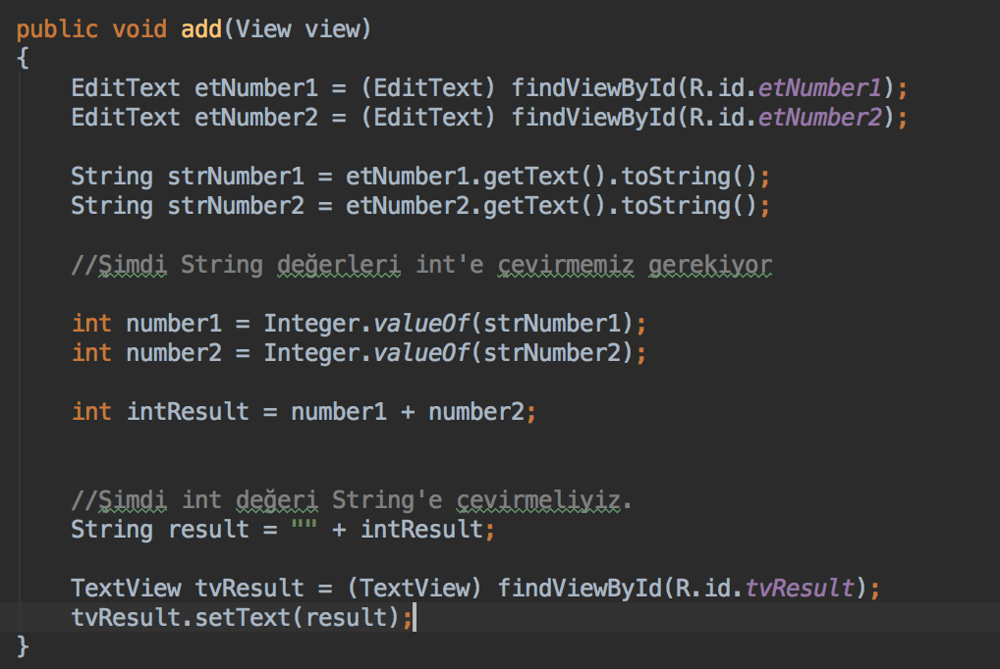
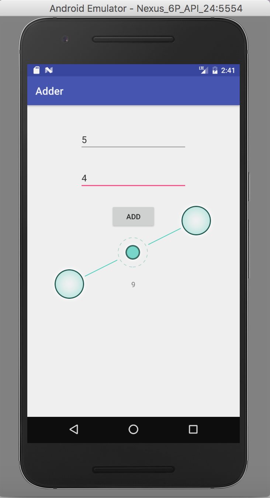

# DAY 2 - Arithmetic Operations

### Bu Örnekte int değeri String'e çevirmeyi, String değeri ise int'e çevirmeyi ele aldık

### Çevirme İşlemlerinin Yapıldığı Method

### Uygulamanın Ekran Görüntüsü

