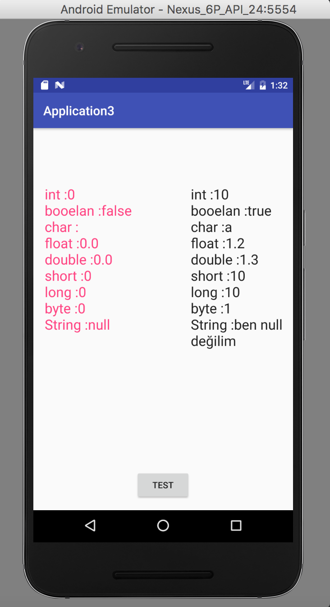
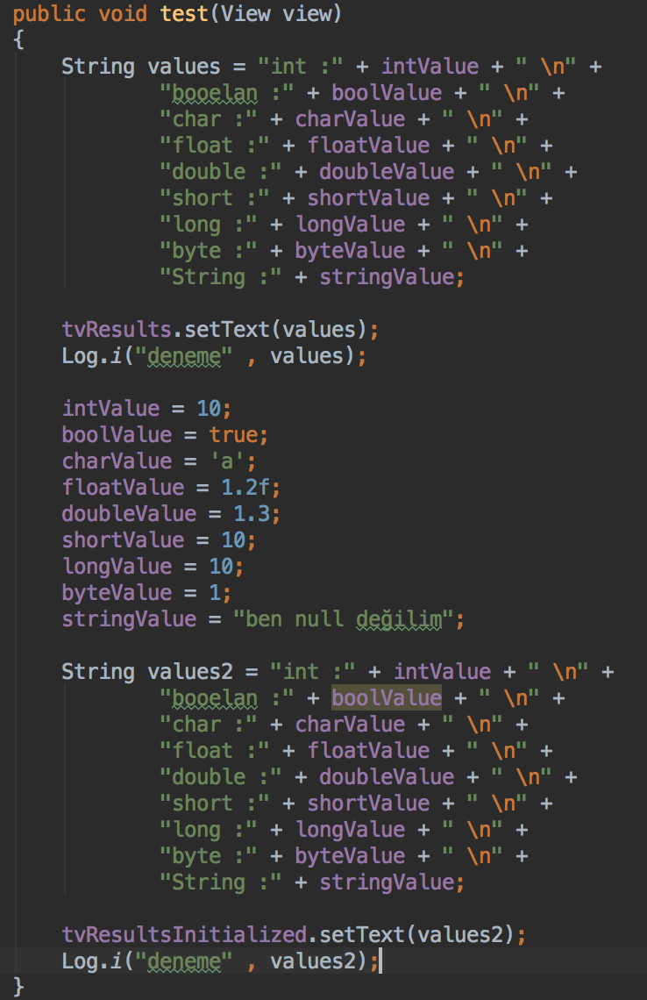
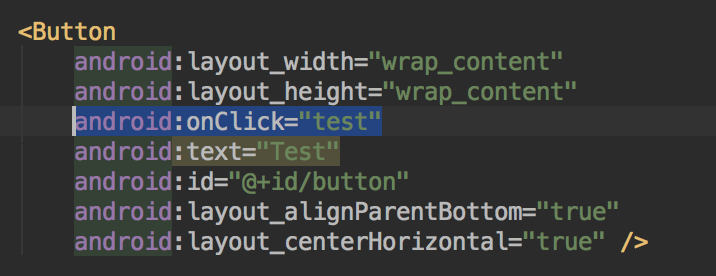

# DAY 2 - Primitive Data Types & Variables

### Bu Örnek Primitive Data Tiplerinin DECLARE Edildikleri Anda Default Bir Değere Sahip Olduklarını Gösteriyor

### İşlemin OnCreate Methodu İçerisinde Değilde test Metodu İçerisinde Yapılmasına Dikkat Edin

### Butona Tıklanılması Durumunda test Metodunun Çalışması Gerektiğini activity_main.xml'de Ayarladık

### Bakınız
Button : https://developer.android.com/reference/android/widget/Button.html

TextView : https://developer.android.com/reference/android/widget/TextView.html
